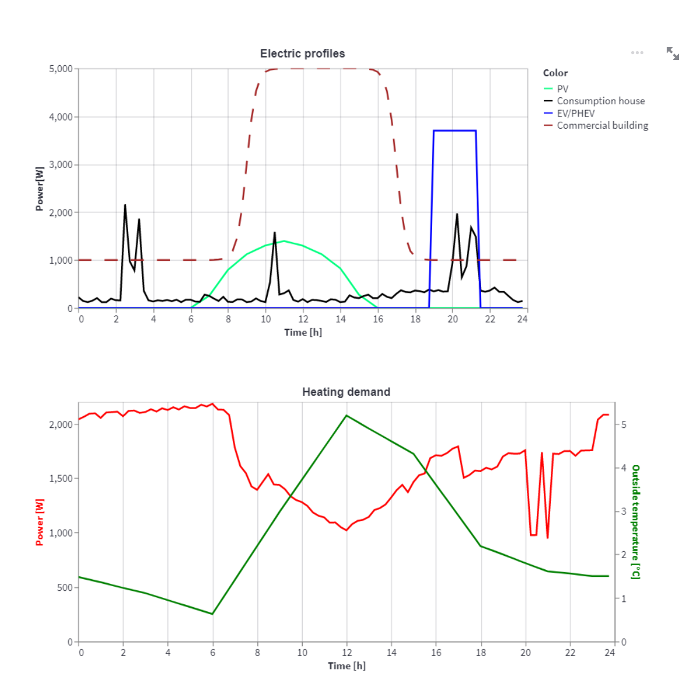
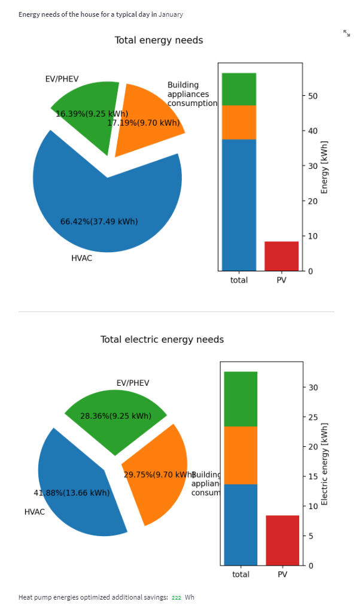
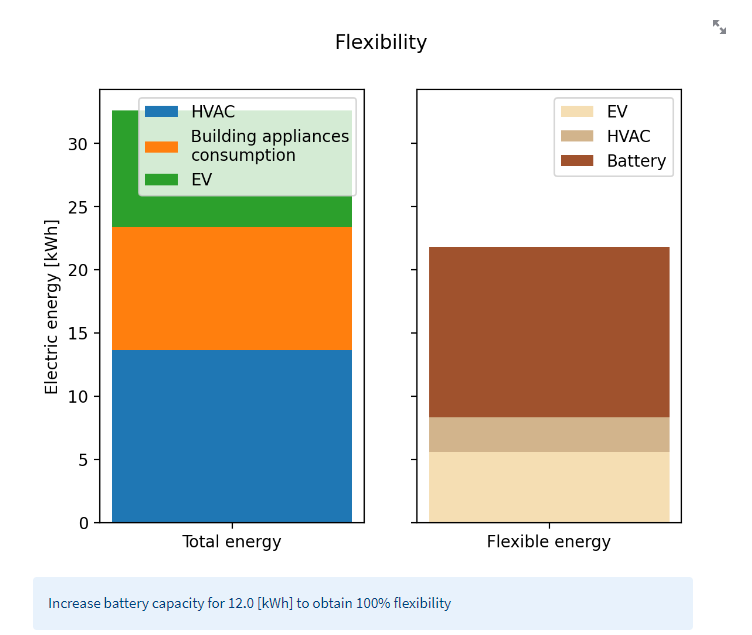

Flexibility Calculator
==============
```diff
! This is an archived version of the S2.1 service. 
! Any future enhancements beyond the MATRYCS project will be made in 
```
[https://gitlab.com/comsensus/flexibilitycalculator](https://gitlab.com/comsensus/flexibilitycalculator)

This tool calculates the flexibility potential of a single household, a commercial building, or a zone consisting of 
multiple households and/or commercial buildings. The parameters that are taken into account in the calculation of the 
flexibility potential are shown in the following figure, together with the program flow:


The service uses different calculated consumption and generation curves together with flexible asset settings and 
windows to calculate the flexibility potential

The tool utilize one open-source library to get statistical profiles of electrical consumption related to the behavior. 
1. Artificial Load Profile Generator (ALPG) https://github.com/GENETX/alpg, please use the modified version, which is 
also updated with the latest available astral package [https://gitlab.com/comsensus/alpg](https://gitlab.com/comsensus/alpg)


As such, the tool is free to use and modify under the GPL v3.0 license

Structure of the project
--------------
The main library responsible for generating the profiles is **profilegenerator2.py**.
Other important files are:
1. **flexibilityUI_zone.py** the streamlit-based UI interface for simulating zone.
2. **flexibilityUI_matrycs.py** same as *flexibilityUI:zone.py*, but with built-in security related to the MATRYCS project.


Zones
--------------
When simulating a zone, the organization of UI differs from the concept of simulating individual buildings. 
This is because some assets are common and do not need to be described individually. Instead, 
things are grouped together to simplify and better understand the influences among different assets. 
For example, photovoltaics can be completely decoupled from the generation of the building profile, 
the same is true for batteries and to some extent for electric vehicles.

User profiles and building profiles are closely linked due to the additional self-heating associated with 
the electricity consumption of building systems and personal heating.


Authors and acknowledgment
--------------

Authors:
1. Andrej Čampa
2. Denis Sodin

The service was developed in the frame of the [MATRYCS project.](https://matrycs.eu/)
The MATRYCS project has received funding from the European Union's Horizon 2020 research and innovation programme under grant agreement no. 1010000158.


Running
--------------

To run the tool, simply use the command: 
```
streamlit run .\flexibilityUI_zone.py
```

The tool is written in the Python3 language and should work on all major platforms. 


Generation
--------------

After clicking Calculate Profiles, the main calculated profiles are displayed on the Profiles tab. 
As you can see in the following figure, two types of outputs are generated. 
First, the profiles of the assets are displayed, including those that were not included in the final calculation. 
And in the second graph, the static heating demand of the zone and the outdoor temperature. 
Depending on the type of HVAC system, this demand is used to calculate the consumption of the corresponding HVAC system 
and the time windows in which the HVAC system must turn on and "compensate"  the energy surplus or deficit.



Output
--------------

The main results can be found under the "Flexibility" tab in the first two charts. Total energy demand is shown along with PV production.
In the second set of diagrams, the previous energy demand is considered, but the heating of the building is modelled according to the selected HVAC. 
Therefore, the HVAC electricity demand is lower due to the higher efficiency (heat pump or air conditioner).
For the "other" types of heating, the electrical energy is not considered because the energy is obtained from another source, e.g. gas.



Finally, the flexibility of the devices is presented, and for each device and use case, the flexibility is calculated differently.
For example, the household electric car cannot be charged during working hours, so we have limited flexibility and not full flexibility. 
Similarly, with HVAC systems: During a certain time window, the system must be turned on. The battery needs to be added 
to cover the energies outside the time window so that the full flexible potential can be used. In addition, the battery can be used for inflexible equipment.



On the "substation" tab you can find the maximum generated/delivered power of the zone. These power are important in the design of
the substation for the zone. Due to penetration of new technologies into the zone the maximum power at the substation can 
easily exceed the rated power of substation, therefore careful planning and understanding of the zone is important.


Version history
--------------

**Version 2.0**
- Implemented zone
- Support any number of buildings and PV systems
- Additional tab for the maximum power of the zone that could affect the substation

**Version 1.0**
- Implemented additional house types
- Fixed bugs related to scaling of energy profiles
- Fixed random bug related to not calculating EV

**Version 0.9**
- ALPG changed to class
- streamlit UI for selecting parameters
- full integration of libraries
- RC simulator changed with new static thermal model of the building, which also considers solar insolation through windows and ventilation
- calculations of metrics and flexibility

**Version 0.2**
- New building model (provides the power exceed or deficit)
- Solar gain calculator (use for south windows)
- Cleaned RC-simulator dependencies in the main program
- All asset profiles are available

**Version 0.1**
- Created first profiles using alpg and RC simulator library
- Calculating PV demand from JRC


