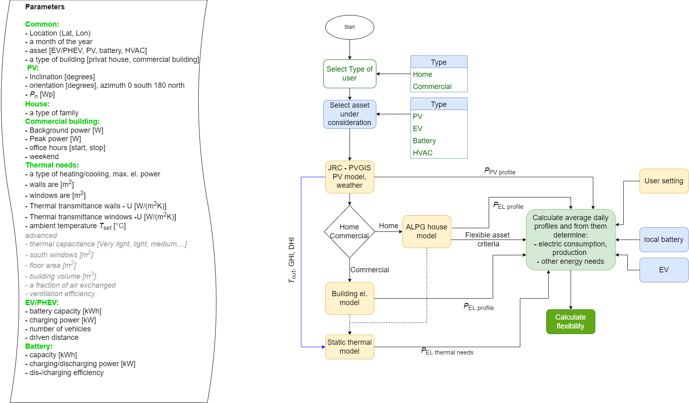
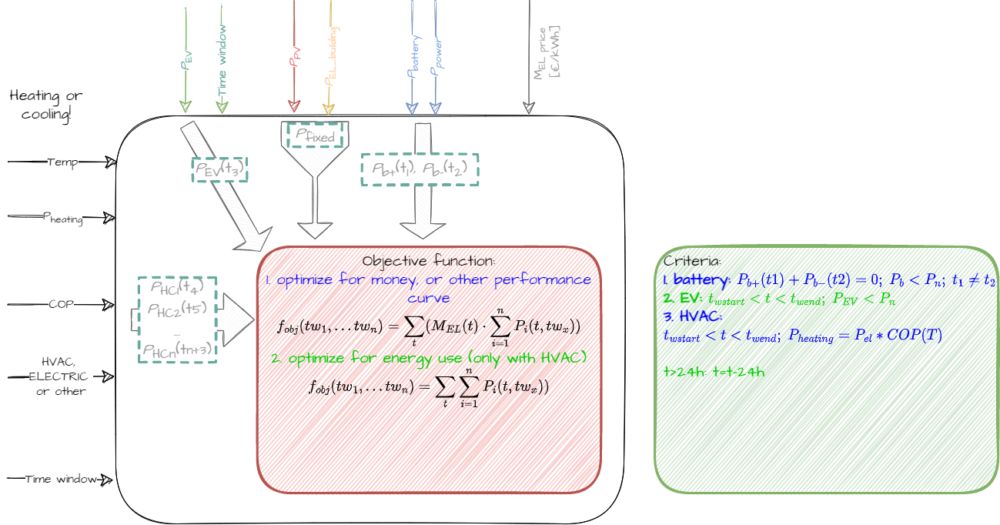

Flexibility Calculator
==============

This tool calculates the flexibility potential of household, building or zone. The parameters used for calculation and program flow is shown in following figure:

The service uses different calculated consumption and generation curves together with flexible asset settings and windows and creates objective function as shown by following figure:

The tool utilize two another tools:

1. Artificial Load Profile Generator (ALPG) https://github.com/GENETX/alpg, please use modified version that is also updated to be able latest astral package available https://gitlab.comsensus.eu/AndrejCampa/alpg
2. RC Building Simulator https://github.com/architecture-building-systems/RC_BuildingSimulator, however we recommend slightly modified version that is available at https://gitlab.comsensus.eu/AndrejCampa/rc_buildingsimulator

As such, the tool is free to use and modify under the GPL v3.0 license

Authors: 

Denis Sodin

Andrej Čampa

Running
--------------

Run and change profilegenerator2

The tool is written in the Python3 language and should work on all major platforms. 

Configuration
--------------
TBD

Generation
--------------

TBD

Output
--------------

TBD

**CSV files***

**Profiles**

**Version 0.1**
- Created first profiles using alpg and RC simulator library
- Calculating PV demand from JRC

