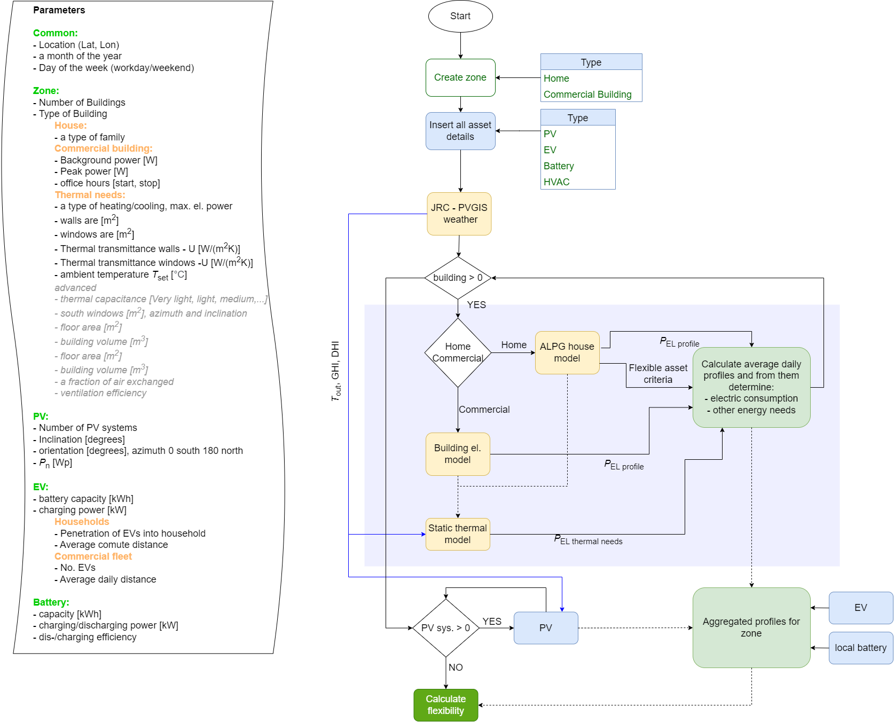

Flexibility Calculator
==============

This tool calculates the flexibility potential of household or building. The parameters used for calculation and program
flow is shown in following figure:

The service uses different calculated consumption and generation curves together with flexible asset settings and 
windows and calculates the flexibility potential

The tool utilize one open-source library to get statistical profiles of electrical consumption related to the behavior. 
1. Artificial Load Profile Generator (ALPG) https://github.com/GENETX/alpg, please use modified version that is also updated to be able latest astral package available https://gitlab.comsensus.eu/AndrejCampa/alpg

As such, the tool is free to use and modify under the GPL v3.0 license

Authors:
1. Andrej Čampa
2. Denis Sodin

Running
--------------

Run streamlit run .\flexibility UI

The tool is written in the Python3 language and should work on all major platforms. 

Generation
--------------

After pressing "Calculate profiles," all asset profiles are shown under the "Profiles" tab. As shown in the following 
figure, two types of output are generated. First, the assets' profiles, even those not considered in 
the final calculation. And in the second graph a static heating demand of the building and outside temperature. According to
the type of HVAC this demand is used to calculate the consumption of appropriate HVAC devices and time windows in which
the HVAC needs to turn on and "compensate" the excess or deficit of energy.

Output
--------------

The main output is under the tab "flexibility" in the first two graphs. The Total energy needs are shown along the PV production.
In the second set of graphs, the previous energy needs are considered; however, the heating of the building is modelled according
to the selected HVAC. Therefore the HVAC electrical needs are lower due to higher efficiency (heat pump or air conditioner). 
In the case of "other" types of heating, electric energy is not considered since the energy is obtained from another source, e.g. gas.

Finally, the flexibility of the devices is shown, and for each device and use case, the flexibility is calculated differently.
For instance, for the EV of the household, the charging can not happen during working hours; therefore, we have reduced and 
not full flexibility. Similarly, for HVAC systems, in a specific time window, the system needs to turn on. The battery 
needs to be added to cover the energies outside the time window to get the full flexible potential. Furthermore, for 
inflexible devices, the battery can be used. 

**Version 0.9**
- ALPG changed to class
- streamlit UI for selecting parameters
- full integration of libraries
- RC simulator changed with own static model of heat building, considering solar insolation through windows and ventilation
- calculations of metrics and flexibility

**Version 0.2**
- Written new building model (provides the power exceed or deficit)
- Solar gain calculator (use for south windows)
- Cleaned RC-simulator dependencies in the main program
- All asset profiles are available

**Version 0.1**
- Created first profiles using alpg and RC simulator library
- Calculating PV demand from JRC

